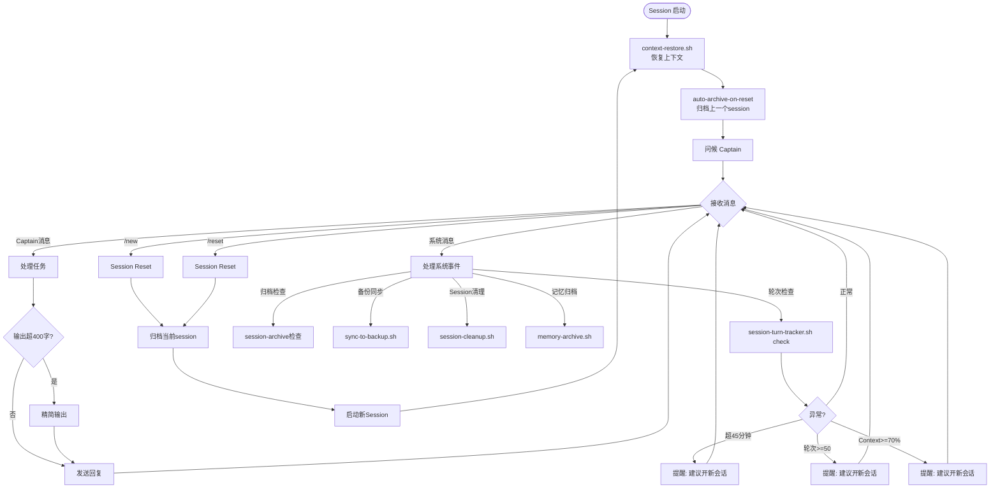
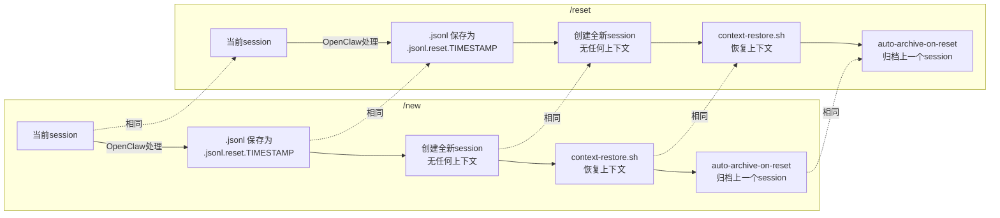
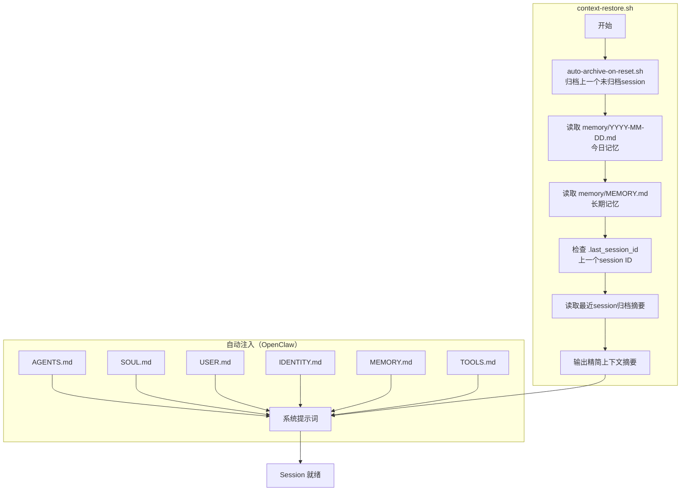
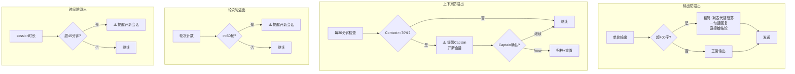
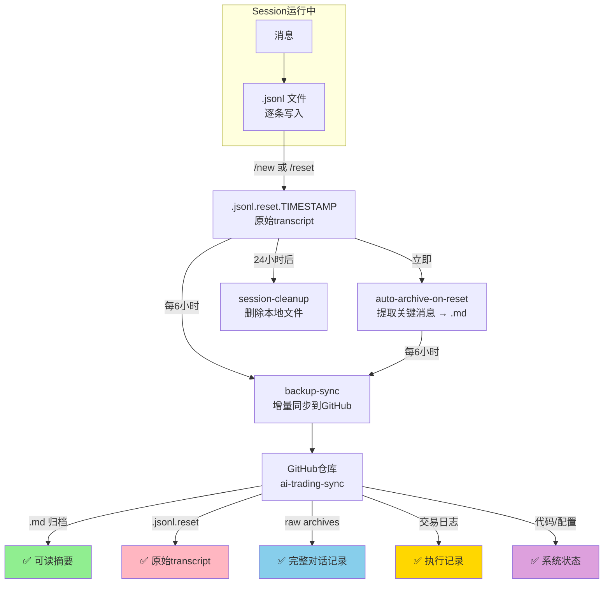

# Session 全生命周期机制全景图 v2

> 3轮对话，25小时跨度，包含所有自动/手动机制

## 一、单次Session内部机制

## 二、/new 与 /reset 的区别

> **/new 和 /reset 行为完全相同**：都保存旧session为.reset文件，创建新session，恢复上下文。

## 三、上下文恢复流程

## 四、防溢出机制

## 五、25小时全流程时间线

```mermaid
gantt
    title Session 全生命周期 (25小时)
    dateFormat HH:mm
    axisFormat %H:%M

    section Session 1
    对话+任务处理     :a1, 09:00, 13min
    /new重置          :milestone, m1, 09:13, 0min

    section Session 2
    auto-archive触发  :a2, 09:13, 1min
    对话+任务处理     :a3, 09:14, 3h
    定时归档(跳过)    :crit, t1, 11:00, 1min
    对话+任务处理     :a4, after a3, 3h
    定时归档(跳过)    :crit, t2, 13:00, 1min
    对话+任务处理     :a5, after a4, 3h
    定时归档(跳过)    :crit, t3, 15:00, 1min
    /new重置          :milestone, m2, 18:00, 0min

    section Session 3
    auto-archive触发  :a6, 18:00, 1min
    对话+任务处理     :a7, 18:01, 15h
    定时归档(跳过)    :crit, t4, 20:00, 1min
    /new重置          :milestone, m3, 09:00, 0min

    section 自动任务
    定时归档(每2h)    :ta, 11:00, 22h
    备份同步(每6h)    :tb, 10:03, 23h
    Session清理(每1h) :tc, 11:00, 22h
    记忆归档(每天2点) :td, 02:00, 1h

    section 备份仓库
    第1次同步         :bs1, 10:03, 1min
    第2次同步         :bs2, 16:03, 1min
    第3次同步         :bs3, 22:03, 1min
    第4次同步         :bs4, 04:03, 1min
    第5次同步         :bs5, 10:03, 1min
```

## 六、数据流全景

## 七、机制汇总表

| 机制 | 触发方式 | 频率 | 作用 | 保护层 |
|------|----------|------|------|--------|
| auto-archive-on-reset | /new 或 /reset | 每次reset | 立即归档上一个session | 第1层 |
| session-archive cron | 定时 | 每2小时 | 补充归档活跃session | 第2层 |
| backup-sync | 定时 | 每6小时 | 增量同步到GitHub | 第3层 |
| session-cleanup | 定时 | 每小时 | 清理超24h孤立文件 | 第4层 |
| memory-archive | 定时 | 每天02:00 | 压缩超30天记忆 | 第5层 |
| session-turn-check | 定时 | 每30分钟 | 防溢出(轮次/时间/context) | 运行时 |
| 输出自检 | 每轮回复 | 实时 | 防输出过量 | 运行时 |
| context-restore | session启动 | 每次 | 恢复上下文 | 启动时 |

---
*v2.0 | 2026-05-30 | First-Mate-feishu*
