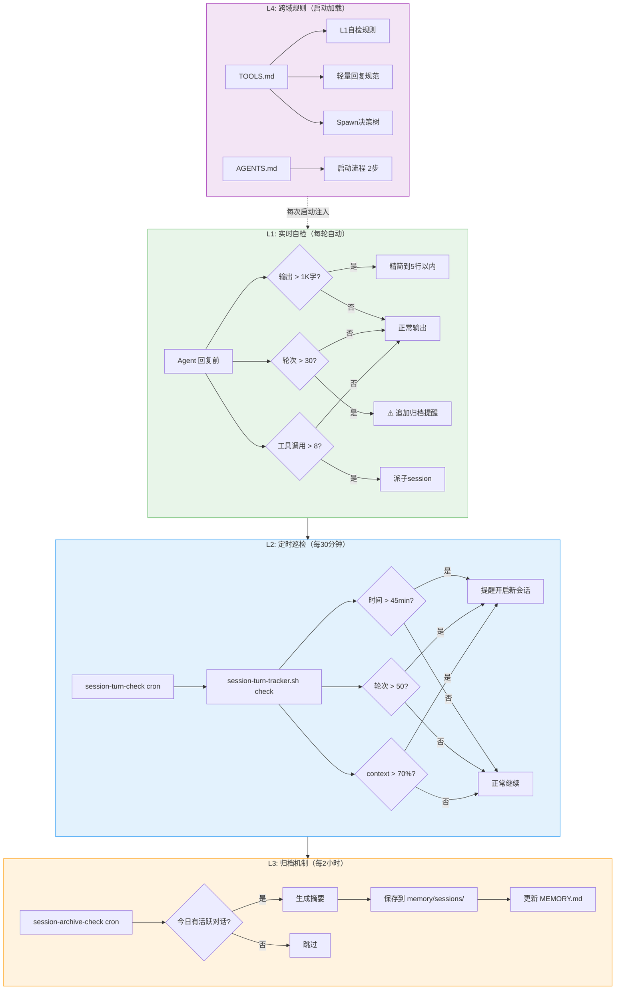
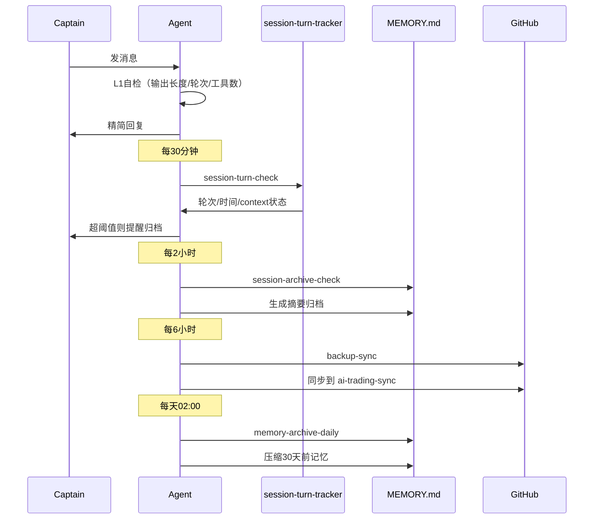

# Session 管理完整链路

## 架构总览

## 数据流

## Cron 任务总表

| 任务 | 频率 | 动作 | 与Token预算关系 |
|------|------|------|----------------|
| session-turn-check | 每30分钟 | 检查轮次/时间/context + output自检 | **直接相关** |
| session-archive-check | 每2小时 | 归档活跃session | 释放上下文 |
| backup-sync | 每6小时 | 同步到GitHub | 无直接关系 |
| memory-archive-daily | 每天02:00 | 压缩旧记忆 | 减少启动加载 |
| SOP任务(6个) | 交易日固定时间 | 盘前/盘中/盘后 | 独立session，不影响主对话 |
| maintenance-check | 每天03:00 | 系统维护 | 无直接关系 |
